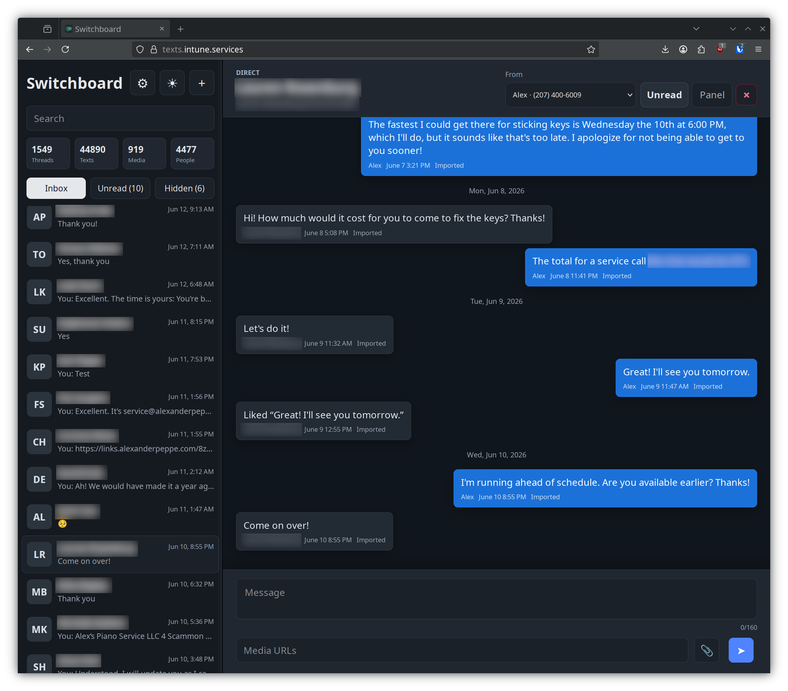

# Switchboard

Switchboard is a local-first communications console for SMS, MMS, group texting, scheduled sends, inbound fax, call forwarding, and voicemail across Telnyx and Twilio. It ships with a desktop web UI/PWA and a small Android WebView wrapper for sideloading.

The server stores conversations, messages, scheduled messages, contacts, sender identities, app settings, voice rules, voicemail recording metadata, and media metadata in SQLite. It can import historical HTML exports, receive Telnyx SMS/MMS/fax and Twilio Messaging webhooks, send outbound Telnyx or Twilio messages, handle TeXML/TwiML-compatible voice callbacks, sync contacts from Fastmail or Google Contacts, and optionally notify an ntfy topic or the Android wrapper when inbound texts arrive.



Authored by [Alexander Peppe](https://www.alexanderpeppe.com/).

Licensed under the Apache License 2.0. See [LICENSE](LICENSE).

## Capabilities

- Conversation inbox for direct and group threads with search across names, phone numbers, message text, and queued scheduled messages.
- Inbox, unread, and hidden views with read/unread, hide/unhide, swipe-to-hide, and bulk read/unread/hide actions.
- Outbound SMS/MMS through Telnyx or Twilio, with per-sender provider routing, delivery status updates, provider error details, and direct/group conversation matching.
- Scheduled outbound messages with text and media, visible queue state in the conversation list and thread, cancellation before send, failed-send display, and automatic recovery of interrupted sends on server restart.
- Inbound Telnyx SMS/MMS, Twilio SMS/MMS, and Telnyx fax storage, including local media caching, PDF fax page previews when `pdftoppm` is installed, and browser-friendly conversion of cached 3GP videos when `ffmpeg` is installed.
- Per-number sender identities with labels, colors, active state, vacation auto-replies, call forwarding, voicemail rules, and text or recorded voicemail greetings.
- Incoming call handling for Twilio and Telnyx TeXML/TwiML-style voice webhooks, including optional forwarding to a phone number or SIP address before voicemail.
- Voicemail storage as conversation messages with audio attachments, phone-provider transcription support, and optional Rev.ai transcription callbacks.
- Fastmail CardDAV, legacy Fastmail JMAP, and Google People API contact sync, plus local contact-name edits and Fastmail CardDAV writeback when configured.
- Settings UI for behavior, language, notifications, sounds, uploads, messaging providers, calls, transcription, contacts, provider credentials, hotkeys, security, 2FA, and database download.
- Statistics view with totals, inbox/hidden/unread counts, inbound/outbound/voicemail/failed/pending/media/contact counts, breakdowns by status/source/type/direction, and an activity timeline by hour, day, or month.
- Notifications through ntfy, browser/app sounds, Android-native polling notifications, and lightweight browser refresh polling based on change tokens.

## Service Map

Switchboard is one app, but a complete deployment usually connects several services:

- **Switchboard server**: Python HTTP app, SQLite database, local media directory, and public upload staging directory.
- **Public HTTPS entrypoint**: Apache, Caddy, nginx, Tailscale Funnel, or another TLS proxy that reaches the local app.
- **Messaging providers**: Telnyx and/or Twilio for SMS, MMS, delivery callbacks, inbound fax, calls, recordings, and provider transcription callbacks.
- **Outbound media fetch path**: a public unauthenticated URL for random-named outbound MMS files and voicemail greeting uploads.
- **Private media path**: authenticated Switchboard routes for received MMS, fax PDFs/previews, voicemail recordings, and cached attachments.
- **Optional integrations**: Fastmail CardDAV or Google People API for contacts, Rev.ai for voicemail transcription, ntfy for notifications, and the Android wrapper for phone notifications.

For production setup, read [INSTALL.md](INSTALL.md). It walks through the order of operations and the callback URLs each outside service needs.

## Quick Start

```bash
python3 -m venv .venv
. .venv/bin/activate
python3 -m pip install -r requirements.txt
cp .env.example .env
python3 server.py --host 127.0.0.1 --port 8766
```

Open `http://127.0.0.1:8766`. On a new install, leave the auth variables blank and the first browser visit will show the account setup screen. For a headless or preconfigured install, generate `TEXTING_AUTH_PASSWORD_HASH` first with `python scripts/hash_password.py`.

## Docker

Switchboard can run as a Docker Compose service with SQLite, media, voicemail recordings, and outbound upload staging stored in the `switchboard-data` volume.

```bash
cp .env.example .env
# Edit .env with your sign-in username, password hash, sender numbers, and provider credentials.
docker compose up -d --build
```

Open `http://127.0.0.1:8766`. To use a different host port, set `SWITCHBOARD_PORT` before starting Compose:

```bash
SWITCHBOARD_PORT=8080 docker compose up -d --build
```

The container binds Switchboard to `0.0.0.0:8766` internally and stores runtime data at `/data`:

- `/data/switchboard.sqlite`: SQLite database.
- `/data/media`: inbound MMS, fax, and voicemail media kept locally.
- `/data/public-uploads`: outbound MMS upload staging.

The image includes `ffmpeg` for browser-friendly video conversion and `poppler-utils` for fax PDF page previews. Switchboard serves outbound upload staging itself at `/uploads/<random-file>`, so Docker installs do not need a second public static directory. The Docker health check uses `/api/health`.

For a systemd-managed Docker install, put the checkout at `/opt/switchboard`, create `/opt/switchboard/.env`, then install the included unit:

```bash
sudo cp docker/systemd/switchboard.service /etc/systemd/system/switchboard.service
sudo systemctl daemon-reload
sudo systemctl enable --now switchboard.service
```

On a public server, keep TLS in front of the app and preserve the public host and scheme. Switchboard provides its own login screen when `TEXTING_AUTH_USERNAME` and `TEXTING_AUTH_PASSWORD_HASH` are set. Provider callback routes such as `/api/telnyx/webhook`, `/api/twilio/webhook`, `/api/telnyx/voice`, `/api/twilio/voice`, `/api/telnyx/voice/recording`, `/api/twilio/voice/recording`, `/api/telnyx/voice/transcription`, `/api/twilio/voice/transcription`, and `/api/revai/webhook` remain reachable without a browser session so phone providers can call them. Outbound MMS uploads and voicemail greeting uploads are stored in `/data/public-uploads` and served by the same app at `/uploads/<random-file>`. Leave `TEXTING_PUBLIC_UPLOAD_BASE_URL` blank to generate URLs from the current public request origin, or set it only when you deliberately serve uploads from a different host/path.

## Configuration

Copy `.env.example` to `.env` and fill in the values you use.

### Sign-In

Switchboard uses an app login screen rather than Apache htpasswd or Basic Auth. On a new install, leave `TEXTING_AUTH_USERNAME` and `TEXTING_AUTH_PASSWORD_HASH` blank; the first browser visit shows a setup screen that writes the chosen account to `.env`. You can also preconfigure sign-in manually:

```env
TEXTING_AUTH_USERNAME=
TEXTING_AUTH_PASSWORD_HASH=pbkdf2_sha256:600000:...
TEXTING_AUTH_SECRET_KEY=...
TEXTING_AUTH_SESSION_DAYS=14
TEXTING_AUTH_TOTP_SECRET=
TEXTING_AUTH_TOTP_ISSUER=Switchboard
TEXTING_AUTH_BACKUP_CODE_HASHES=
```

Generate the password hash from the checkout:

```bash
python scripts/hash_password.py
```

You can also generate it from the installed package or Docker image with:

```bash
python -m texting_app.auth hash-password
```

`TEXTING_AUTH_SECRET_KEY` signs browser sessions. It is optional, but recommended so sessions stay valid across restarts without using the password hash as the signing key:

```bash
python -m texting_app.auth secret-key
```

Account name, password, and optional app-based 2FA can be managed from `Settings` > `Security` after signing in. The in-app 2FA setup shows a QR code, the manual authenticator secret, and one-time backup codes, then enables 2FA after a valid authenticator code is entered.

For env-managed installs, generate authenticator values from the command line:

```bash
python -m texting_app.auth setup-2fa --username admin
```

Add the printed `TEXTING_AUTH_TOTP_SECRET` and `TEXTING_AUTH_BACKUP_CODE_HASHES` values to `.env`, then manually enter the secret in your authenticator app or import the printed `otpauth://` URI if your app supports it. Save the printed backup codes somewhere private; they are shown once, are accepted in the same login field as authenticator codes, and each backup code can only be used once. 2FA configured in `.env` is shown in Settings but must be disabled by removing the env values.

Leave `TEXTING_AUTH_DISABLED=0` for deploys. Set it to `1` only for trusted local development with another access boundary.

Important settings:

- `TEXTING_AUTH_USERNAME`: browser login username.
- `TEXTING_AUTH_PASSWORD_HASH`: PBKDF2-SHA256 hash generated by `python scripts/hash_password.py`.
- `TEXTING_AUTH_SECRET_KEY`: optional session-signing secret generated by `python -m texting_app.auth secret-key`.
- `TEXTING_AUTH_TOTP_SECRET`: optional authenticator-app secret generated by `python -m texting_app.auth setup-2fa`.
- `TEXTING_AUTH_BACKUP_CODE_HASHES`: optional comma-separated one-time backup code hashes generated by `python -m texting_app.auth setup-2fa`.
- `TEXTING_AUTH_DISABLED`: disables app sign-in when set to `1`; use only behind another trusted access boundary.
- `TEXTING_HOST` / `TEXTING_PORT`: address and port for `server.py`.
- `TEXTING_DATA_DIR`: base runtime directory for SQLite, media, and upload staging defaults.
- `TEXTING_DB`: SQLite path. Use a path outside the Git checkout in production.
- `TEXTING_MEDIA_DIR`: local directory for received media, cached attachments, converted videos, fax page previews, and voicemail recordings.
- `TEXTING_PERSONAL_NUMBERS`: comma-separated sender numbers that belong to you.
- `TEXTING_IDENTITY_LABELS`: JSON object mapping sender numbers to display labels.
- `TEXTING_MESSAGING_PROVIDER`: default outbound provider, `telnyx` or `twilio`.
- `TEXTING_PROVIDER_BY_NUMBER`: optional JSON object mapping sender numbers to `telnyx` or `twilio`.
- `TELNYX_API_KEY`: required for sending texts.
- `TELNYX_PUBLIC_KEY`: enables Telnyx webhook signature verification.
- `TELNYX_API_BASE`: Telnyx API base URL; normally leave the default.
- `TWILIO_ACCOUNT_SID`: required for sending through Twilio.
- `TWILIO_AUTH_TOKEN`: required for Twilio sends and enables Twilio webhook signature verification.
- `TWILIO_API_BASE`: Twilio API base URL; normally leave the default.
- `TWILIO_WEBHOOK_URL`: exact public Twilio webhook URL. Recommended when the app sits behind a proxy.
- `TWILIO_STATUS_CALLBACK_URL`: optional delivery callback URL sent with outbound Twilio messages.
- `TEXTING_VOICEMAIL_TRANSCRIPTION_PROVIDER`: `provider` or `revai`.
- `REVAI_ACCESS_TOKEN`: Rev.ai access token for voicemail transcription.
- `REVAI_API_BASE`: Rev.ai API base URL; normally leave the default.
- `TEXTING_UI_LANGUAGE`: `auto`, `en`, `es`, or `fr`.
- `TEXTING_AUTO_REFRESH_SECONDS`: browser refresh check interval. Set to `0` to disable.
- `TEXTING_SHOW_SUMMARY_STATS`: show or hide statistic bubbles above the conversation list.
- `TEXTING_SHOW_COMPOSER_COUNTER`: show or hide the SMS segment counter in the composer.
- `NTFY_ENDPOINT`: optional HTTPS ntfy topic URL for inbound message notifications.
- `NTFY_ENABLED`: enables or disables ntfy without removing the endpoint.
- `TEXTING_NATIVE_NOTIFICATIONS_ENABLED`: optional Android app native notifications. Defaults off.
- `TEXTING_NATIVE_NOTIFICATION_INTERVAL_MINUTES`: Android app notification check interval. Android periodic checks have a 15 minute minimum.
- `TEXTING_SEND_SOUND_ENABLED`, `TEXTING_SEND_SOUND_TONE`, `TEXTING_RECEIVE_SOUND`, `TEXTING_RECEIVE_SOUND_TONE`, `TEXTING_SOUND_VOLUME`: browser/app sound-effect controls.
- `TEXTING_PUBLIC_UPLOAD_DIR`: local directory where uploaded outbound MMS files and voicemail greeting recordings are staged.
- `TEXTING_PUBLIC_UPLOAD_BASE_URL`: optional public URL override for staged uploads. Leave blank to use the current public Switchboard origin plus `/uploads`.
- `TEXTING_UPLOAD_MAX_FILE_MB`: maximum upload size accepted by the app.
- `TEXTING_CACHE_ATTACHMENTS`: caches remote received attachments locally when they are viewed.
- `CONTACTS_PROVIDER`: `auto`, `fastmail`, `google`, or `none`.
  `auto` uses Fastmail when configured, otherwise Google when configured.
- `CONTACTS_AUTOSYNC`: enables background contact sync at startup.
- `CONTACTS_SYNC_INTERVAL_MINUTES`: background contact sync interval.
- `FASTMAIL_USERNAME`, `FASTMAIL_APP_PASSWORD`, `FASTMAIL_CARDDAV_URL`, `FASTMAIL_CARDDAV_USERNAME`: Fastmail CardDAV settings.
- `FASTMAIL_API_TOKEN`, `FASTMAIL_ACCOUNT_ID`: legacy Fastmail JMAP settings.
- `GOOGLE_CLIENT_ID`, `GOOGLE_CLIENT_SECRET`, `GOOGLE_REFRESH_TOKEN`: Google People API refresh-token credentials.
- `GOOGLE_TOKEN_URI`, `GOOGLE_PEOPLE_API_BASE`: Google OAuth and People API base URLs; normally leave the defaults.
- `GOOGLE_CONTACTS_ACCESS_TOKEN`: optional short-lived Google token for testing.

The web UI also has a Settings menu. Values saved there are stored in SQLite and override the matching `.env` values where a setting has an environment equivalent; settings without an env equivalent are still stored in SQLite. Settings covers behavior, language, hotkeys, notifications, sounds, uploads, messaging provider selection, calls, transcription, contacts, Telnyx, Twilio, Fastmail, and Google Contacts. Secrets are never echoed back to the browser; leave a secret field blank to keep its current value. Settings also includes a protected database download button; Switchboard creates a consistent SQLite backup for the logged-in user instead of exposing the data directory.

### Bring Your Own Numbers

Switchboard does not ship with sender phone numbers or provider credentials. Add numbers that you own or control in your Telnyx or Twilio account:

```env
TEXTING_PERSONAL_NUMBERS=+15551230001,+15551230002
TEXTING_IDENTITY_LABELS={"+15551230001":"Personal","+15551230002":"Work"}
```

If every sender number uses the same provider, set the default provider:

```env
TEXTING_MESSAGING_PROVIDER=telnyx
```

If you mix Telnyx and Twilio sender numbers, map each sender number explicitly:

```env
TEXTING_PROVIDER_BY_NUMBER={"+15551230001":"telnyx","+15551230002":"twilio"}
```

Then fill in only the credentials for the providers you use:

```env
TELNYX_API_KEY=
TWILIO_ACCOUNT_SID=
TWILIO_AUTH_TOKEN=
```

Restarting the server seeds any new `TEXTING_PERSONAL_NUMBERS` into the local sender identity table. In the web UI, the Numbers panel can rename and recolor those sender identities, and can enable a vacation auto-reply for one sender number at a time. Auto-replies are sent only for direct inbound texts, use the selected sender number's configured Telnyx/Twilio provider, and are rate-limited per recipient by the cooldown on that number. Settings > Messaging can adjust the default provider and per-number provider map without editing source.

The same Numbers panel manages per-number call behavior. Each sender number can forward incoming calls to a phone number or SIP address, set the ring timeout from 5 to 120 seconds, enable or disable voicemail, and use either a text greeting or an uploaded public audio greeting. Settings > Calls provides global defaults for numbers without a saved per-number voice rule.

The Telnyx webhook endpoint is:

```text
/api/telnyx/webhook
```

Use this endpoint for both Messaging Profile webhooks and Programmable Fax Application webhooks. Inbound `fax.received` events are stored as inbound picture messages: the Telnyx fax PDF is downloaded immediately and rendered into PNG page attachments when `pdftoppm` is available. Failed inbound fax attempts are stored too, including Telnyx's `failure_reason` when one is provided. If PDF rendering is unavailable, the local PDF is kept as the attachment fallback.

On Debian/Ubuntu servers, install the optional fax preview dependency with:

```bash
sudo apt install poppler-utils
```

Some inbound phone videos arrive as `.3gp` / `video/3gpp`, which most browsers cannot play inline. When `ffmpeg` is installed, Switchboard automatically converts local 3GP attachments to browser-friendly MP4 the first time the message is loaded, then stores the converted attachment path for future views:

```bash
sudo apt install ffmpeg
```

The Twilio webhook endpoint is:

```text
/api/twilio/webhook
```

Use it for incoming Messaging webhooks and, if you want delivery updates, as the status callback URL. Twilio posts form-encoded webhook payloads for regular Messaging callbacks; when `TWILIO_AUTH_TOKEN` is configured, the app validates `X-Twilio-Signature`. If Apache, Tailscale Serve, or another proxy changes the public URL, prefer preserving the public `Host` and `X-Forwarded-Proto` headers. `TWILIO_WEBHOOK_URL` is a single exact-URL override used by Twilio signature verification, so it is best for simple deployments where all Twilio callbacks validate against the same configured URL.

For inbound Twilio Group MMS, also create a Twilio Event Streams webhook sink that points to the same `/api/twilio/webhook` URL and subscribe it to `com.twilio.messaging.inbound-message.received` schema v5 or newer. Switchboard reads the Event Streams `recipients` array and stores the sender plus the other group recipients as conversation participants. Without that Event Streams payload, Twilio's regular incoming-message webhook may only include the sender and your Twilio number.

### Call Forwarding and Voicemail

Switchboard returns TeXML/TwiML-compatible XML for inbound voice calls. Point Twilio voice webhooks at:

```text
/api/twilio/voice
```

Point Telnyx TeXML voice webhooks at:

```text
/api/telnyx/voice
```

Switchboard builds the callback URLs it returns from the current request host, so the public URL seen by Twilio or Telnyx should match the reverse proxy host. If a sender number has call forwarding enabled, Switchboard first returns a `<Dial>` response to the configured phone number or SIP address. If the dial is answered, the call is hung up when the provider reports completion. If the dial is not answered, or forwarding is off, Switchboard records voicemail when voicemail is enabled. If voicemail is disabled, the call is rejected.

Recording and transcription callbacks are generated automatically in the XML response:

```text
/api/twilio/voice/recording
/api/twilio/voice/transcription
/api/telnyx/voice/recording
/api/telnyx/voice/transcription
```

Twilio voice callbacks use `TWILIO_AUTH_TOKEN` for signature verification. Telnyx voice callbacks use `TELNYX_PUBLIC_KEY` for signature verification. Leave those values blank only for trusted local testing.

Voicemails can use the phone provider's transcript or Rev.ai. Set `TEXTING_VOICEMAIL_TRANSCRIPTION_PROVIDER=revai` and provide `REVAI_ACCESS_TOKEN`, or save both values in Settings > Transcription. Rev.ai posts completed jobs back to:

```text
/api/revai/webhook
```

When Rev.ai is enabled, Switchboard downloads the provider recording, submits it to Rev.ai with `/api/revai/webhook` as the notification URL, and stores the completed transcript as an inbound voicemail message in the caller's conversation. If Rev.ai submission fails for a meaningful recording, Switchboard stores a voicemail message with `No transcript available.` so the recording is still visible. Very short or empty recordings are skipped.

Outbound provider selection is resolved from the sender number. `TEXTING_PROVIDER_BY_NUMBER` wins first, then `TEXTING_MESSAGING_PROVIDER` is used as the default. Example:

```env
TEXTING_MESSAGING_PROVIDER=telnyx
TEXTING_PROVIDER_BY_NUMBER={"+15551230001":"telnyx","+15551230002":"twilio"}
```

Twilio's single-message API sends to one recipient at a time, so a multi-recipient send fans out to each recipient and stores the result as one conversation message.

### Sending, Scheduling, and Status

The composer can send immediately or schedule a message for a future time. Scheduled messages can include manually entered media URLs or files uploaded through the composer. Queued messages appear inline in the thread and can be canceled until the worker starts sending them. They also influence the conversation list sort order, so a future queued send stays visible.

The server starts a background scheduled-message worker at launch. It checks for due messages about every 10 seconds, sends them through the sender number's resolved provider, marks successful rows as `sent`, and links the sent provider message back to the queued row. If a send fails, the scheduled item remains visible with the provider error. If the server stops while a scheduled message is in `sending`, the next launch returns it to `queued` before the worker starts.

Delivery status is updated from provider callbacks where available. Telnyx outbound events update sent, delivered, finalized, failed, delivery-failed, and delivery-unconfirmed states. Twilio status callbacks update queued/sent/delivered/undelivered/failed-style states for known message SIDs. Failed and warning statuses expose provider details in the UI when the webhook payload includes them.

### Language and Hotkeys

The interface can run in English, Spanish, or French. Set `TEXTING_UI_LANGUAGE=auto` to follow the browser, or choose `en`, `es`, or `fr` in Settings.

The browser checks `/api/refresh` on the configured auto-refresh interval. That endpoint returns lightweight change tokens first; the app only reloads the conversation list or open thread when those tokens change. Use `TEXTING_AUTO_REFRESH_SECONDS=0`, or set Auto-refresh seconds to `0` in Settings, to disable browser polling.

The summary statistic bubbles above the conversation list open the fuller statistics view. Hide them with `TEXTING_SHOW_SUMMARY_STATS=0`, or turn off Show summary stats in Settings > Behavior. The composer SMS segment counter can be hidden with `TEXTING_SHOW_COMPOSER_COUNTER=0` or Settings > Behavior.

### Stats, Backup, and Data

The statistics view supports all time, today, last 7 days, last week, last 30 days, this month, last month, year to date, and last year. It reports totals for threads, inbox, hidden, unread, texts, inbound, outbound, voicemails, failed, pending, media, and people. It also breaks messages down by status, source, type, and direction, and renders an activity timeline by hour for today, by day for shorter windows, and by month for year/all-time views.

Settings includes a protected database download button. It creates a consistent SQLite backup from the live database and downloads it as `switchboard-YYYYMMDD-HHMMSS.sqlite`; it does not expose the full data directory. Attachments and public uploads are separate files, so back up `TEXTING_MEDIA_DIR` and `TEXTING_PUBLIC_UPLOAD_DIR` along with the SQLite file when you need a full restore point.

Send and receive sound effects are configurable in Settings > Sounds. `TEXTING_RECEIVE_SOUND=auto` plays receive tones unless ntfy notifications are enabled, so ntfy-backed installs stay quiet by default.

Hotkeys are enabled by default and can be changed in Settings > Hotkeys. Defaults:

- `n`: new conversation
- `/`: focus search
- `m`: focus message
- `r`: read/unread
- `h`: hide/unhide
- `p`: toggle the side panel
- `j` / `k`: next/previous thread

### Outbound Media Uploads

The composer can upload image, video, audio, or PDF files and attach their public URLs to an outbound MMS. The same upload pipeline is used for voicemail greeting recordings. Configure `TEXTING_PUBLIC_UPLOAD_DIR` as a writable directory outside the checkout. Switchboard serves that directory at `/uploads/<random-file>` without requiring a browser session.

Telnyx or Twilio must be able to fetch uploaded outbound media without browser login. With the built-in app login, no extra upload configuration is needed beyond a provider-reachable public Switchboard URL. Leave `TEXTING_PUBLIC_UPLOAD_BASE_URL` blank and upload URLs will be generated as `https://your-switchboard-host/uploads/<random-file>` from the request host. If the main app is behind another access layer such as Basic Auth, exempt `/uploads/` along with the provider callback routes, or set `TEXTING_PUBLIC_UPLOAD_BASE_URL` to a provider-reachable upload URL. The upload API enforces `TEXTING_UPLOAD_MAX_FILE_MB` and accepts images, video, audio, and PDFs.

Received attachments can be cached into `TEXTING_MEDIA_DIR` when opened so old provider URLs do not have to stay available forever. Keep `TEXTING_CACHE_ATTACHMENTS=1` for that behavior, or disable it in Settings > Uploads.

## Importing Old Texts

Set `TEXTING_PERSONAL_NUMBERS` first so the importer can distinguish your outgoing messages from incoming messages, then run:

```bash
python3 -m texting_app.import_texts /path/to/texts.tar.gz
```

The importer reads the old HTML export, extracts message text and metadata, and stores only normalized conversation/message records in SQLite.

## Contacts

The app stores imported contacts locally and links them to conversation participants by phone number. `CONTACTS_PROVIDER=auto` chooses Fastmail when Fastmail credentials are configured, otherwise Google when Google credentials are configured, otherwise no sync provider. You can also choose the provider in Settings > Contacts.

Contact sync runs once in the background loop after startup and then repeats at `CONTACTS_SYNC_INTERVAL_MINUTES` while `CONTACTS_AUTOSYNC=1`. The Settings panel also has a manual Sync button. If you rename a phone number in the thread side panel, Switchboard saves the local name immediately. When Fastmail CardDAV credentials are configured, that rename is also written back to Fastmail; without Fastmail CardDAV it remains a local contact name.

### Fastmail

Fastmail sync uses CardDAV by default:

```env
CONTACTS_PROVIDER=fastmail
FASTMAIL_USERNAME=you@example.com
FASTMAIL_APP_PASSWORD=your-app-password
```

Legacy JMAP API-token sync is still available with `FASTMAIL_API_TOKEN`.

### Google Contacts

Google sync uses the People API contact connections feed. Configure an OAuth client in Google Cloud, enable the People API, and grant this scope:

```text
https://www.googleapis.com/auth/contacts.readonly
```

Generate an authorization URL:

```bash
GOOGLE_CLIENT_ID=... scripts/google_contacts_oauth.py
```

Open the URL, approve access, copy the returned `code`, then exchange it:

```bash
GOOGLE_CLIENT_ID=... GOOGLE_CLIENT_SECRET=... scripts/google_contacts_oauth.py --code YOUR_CODE
```

Put the returned refresh token in `.env`:

```env
CONTACTS_PROVIDER=google
GOOGLE_CLIENT_ID=...
GOOGLE_CLIENT_SECRET=...
GOOGLE_REFRESH_TOKEN=...
```

For temporary testing, you may set `GOOGLE_CONTACTS_ACCESS_TOKEN` instead of refresh-token credentials.

## Running Behind Apache

Use Apache as the public TLS boundary, then proxy to the local server:

```apache
ProxyPreserveHost On
ProxyPass / http://127.0.0.1:8766/
ProxyPassReverse / http://127.0.0.1:8766/
RequestHeader set X-Forwarded-Proto "https"
```

Do not add Basic Auth in front of Switchboard unless you also exempt the phone-provider callback routes, `/api/revai/webhook`, and `/uploads/`. Keep `/media/` behind the app because received media and voicemail recordings are private, and keep the database writable by the service user and outside the web root. Uploads use random filenames and are served by Switchboard from `TEXTING_PUBLIC_UPLOAD_DIR`.

## Android Wrapper

The sideload wrapper is in `mobile/android`. The packaged APK includes the server URL you build it with, so do not commit or publish a build made with your private URL unless that is intentional. Set the private server URL in ignored local properties:

```properties
# mobile/android/local.properties
SWITCHBOARD_APP_URL=https://switchboard.example.com
```

You can also start from the checked-in template:

```bash
cp mobile/android/local.properties.example mobile/android/local.properties
```

The Android build fails if `SWITCHBOARD_APP_URL` is missing, which keeps a packaged app from silently embedding a stale personal URL.

Then build:

```bash
cd mobile/android
ANDROID_HOME=/usr/lib/android-sdk gradle assembleDebug
```

Install the generated debug APK with `adb install -r app/build/outputs/apk/debug/app-debug.apk`.

The Android app can optionally show native notifications for incoming texts. Enable `Phone app native notifications` in Settings if you want this in addition to, or instead of, ntfy. The app checks `/api/mobile/notifications`, stores a private cursor on the phone so old messages are not replayed, and opens the matching conversation when a notification is tapped. On Android 13 and newer, allow the notification permission when prompted. If Apache Basic Auth protects the app, sign in through the app once so the native poller can reuse those credentials for the notification API.

This is poll-based, not Firebase push: Android runs an immediate check when the app starts/resumes and a persisted background job at the interval set in Settings. Android enforces a 15 minute minimum and can still batch work for battery scheduling.

## Tailscale

See [tailscale/README.md](tailscale/README.md). The sample config exposes the local server as `svc:switchboard` on HTTPS port 443.
